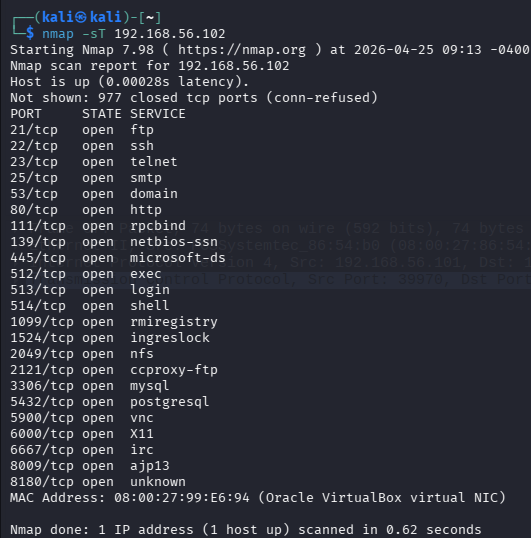
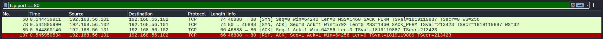
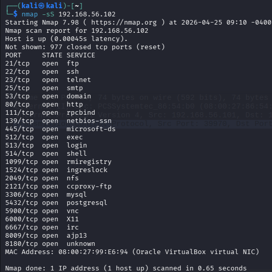
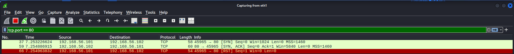

# Nmap TCP Scan Analysis using Wireshark

## Objective

To analyze TCP connection behavior using Nmap scans (`-sT` and `-sS`) and observe packet-level differences in Wireshark.

---

## Lab Setup

- **Attacker:** Kali Linux (192.168.56.101)
- **Target:** 192.168.56.102
- **Network:** VirtualBox Host-Only (192.168.56.0/24)

### Tools
- Nmap
- Wireshark

---

## Initial Network Verification

### Check IP Address

```bash
ip a
```

or

```bash
ifconfig
```

**Observation:**
- Attacker IP: 192.168.56.101
- Interface used: `eth1`

---

### Test Connectivity

```bash
ping 192.168.56.102
```

**Result:**
- Successful replies received
- Target is reachable

> Note: Ping uses ICMP, not TCP, but confirms basic connectivity.

---

## Host Discovery

**Command:**
```bash
nmap -sT -p 80,443 192.168.56.0/24
```

**Result:**
- Active hosts discovered: 192.168.56.1, .100, .101, .102
- Port 80 open on 192.168.56.102

---

## TCP Connect Scan (-sT)

**Command:**
```bash
nmap -sT 192.168.56.102
```

**Nmap Output:**

The scan reveals multiple open ports including FTP (21), SSH (22), and HTTP (80).



### Wireshark Analysis

Filter used:
```bash
tcp.port == 80
```

Observed packets:
1. SYN → Target
2. SYN-ACK → Response from target
3. ACK → Handshake completed
4. RST → Connection reset

**Conclusion:**
- Full TCP handshake observed  
- Connection is established and then immediately reset by the scanner  
- Confirms behavior of `-sT` scan  
- This behavior indicates that the operating system completes the full TCP connection on behalf of Nmap.

📸 Screenshot:


---

## SYN Scan (-sS)

**Command:**
```bash
sudo nmap -sS 192.168.56.102
```

**Nmap Output:**

The scan reveals multiple open ports (e.g., FTP 21, SSH 22, HTTP 80) while using a half-open technique that does not complete the full TCP handshake.



### Wireshark Analysis

**Filter used:**
```bash
tcp.port == 80
```

**Observed packets:**
1. SYN → Sent to target
2. SYN-ACK → Response from target
3. RST → Connection reset immediately

**Conclusion:**
- No ACK is sent
- TCP handshake is not completed
- Connection remains half-open
- This confirms stealth behavior of `-sS` scan

📸 Screenshot:


---

## Comparison: -sT vs -sS

| Feature        | -sT (Connect Scan) | -sS (SYN Scan) | Why It Matters |
|---------------|------------------|---------------|----------------|
| Handshake     | Full             | Partial       | Detectability  |
| Final Packet  | ACK              | RST           | Leaves fewer logs |
| Detectability | High             | Lower         | IDS evasion    |
| Speed         | Slower           | Faster        | Efficiency     |

---

## Key Takeaways

- TCP 3-way handshake: SYN → SYN-ACK → ACK
- Nmap `-sT` completes the handshake
- Nmap `-sS` performs a half-open scan
- Packet-level analysis reveals scan behavior

---

## Real-World Relevance

SYN scans (`-sS`) are widely used in penetration testing because they do not complete the TCP handshake, making them less likely to be logged by target systems.

However, modern intrusion detection systems (IDS) can still detect SYN scan patterns based on abnormal connection behavior.
